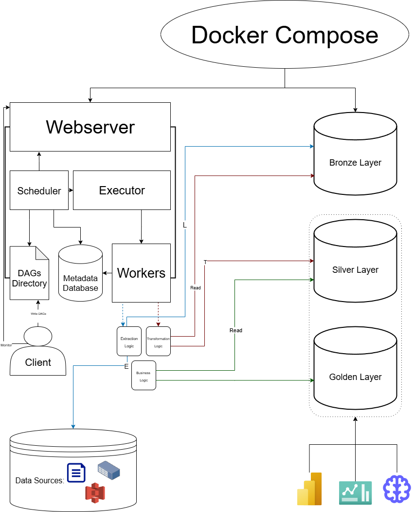

# 🛠️ API ETL Pipeline with Airflow, PostgreSQL & dbt (Bronze/Silver/Gold)

## 📌 Business Case & Problem Statement
Modern companies rely on external APIs and third-party data providers to enrich their analytics and decision-making. However, raw API data is often messy, unstructured, and not directly usable by business teams.

In this project, I simulate a scenario where a retail company depends on the **Fakestore API** to retrieve information about products, users, and orders. Currently, data is pulled manually, making it difficult to:

- Ensure consistency and traceability of data loads  
- Handle incremental ingestion (only new records since the last load)  
- Track data quality and processing errors  
- Deliver clean, analytics-ready datasets to downstream teams  

This ETL pipeline addresses these challenges by:  
- Extracting raw data from the Fakestore API  
- Loading it into a PostgreSQL database following a **Bronze → Silver → Gold** architecture  
- Using **Apache Airflow** to orchestrate ingestion and log batch metadata  
- Leveraging **dbt (planned)** to transform Bronze data into clean Silver and aggregated Gold layers  
- Preparing the foundation for **dashboards and reporting** (e.g., product trends, user activity)  

Ultimately, the project demonstrates how a data engineering workflow can transform unreliable, manual API pulls into a **scalable, automated, and production-like pipeline** that business teams can trust.

---

## 🎯 Project Goals
- Build an **incremental ETL pipeline** to handle external API data  
- Implement **Bronze/Silver/Gold layers** for clean separation of raw, transformed, and analytics-ready data  
- Ensure **logging, traceability, and error handling** for every ingestion run  
- Lay the groundwork for **analytics dashboards** (trends, user activity, product analysis)  

---

## 🏗️ Architecture

  

- **Bronze Layer**: Raw JSON with metadata, logs, and error tracking  
- **Silver Layer** *(planned with dbt)*: Cleaned, structured tables  
- **Gold Layer** *(planned with dbt)*: Aggregated, business-facing datasets  

---

## ⚙️ Tech Stack
- **Python** (data ingestion, utilities)  
- **Apache Airflow** (scheduling & orchestration)  
- **PostgreSQL** (data storage)  
- **dbt** (transformations — planned)  
- **Docker Compose** (environment setup)  
- *(Future)* **Grafana + Prometheus** for monitoring  
