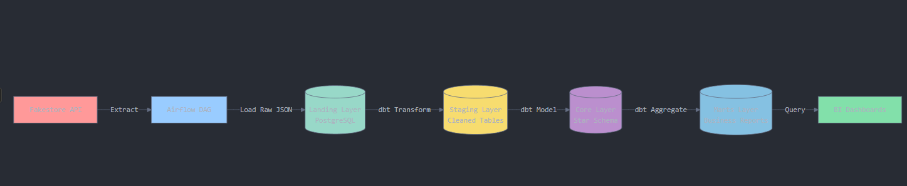
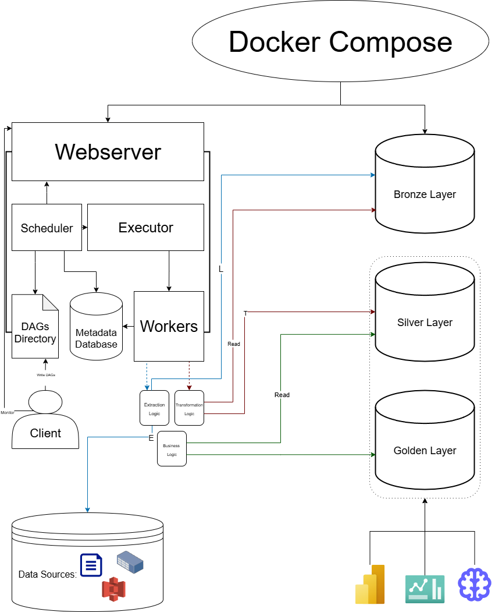
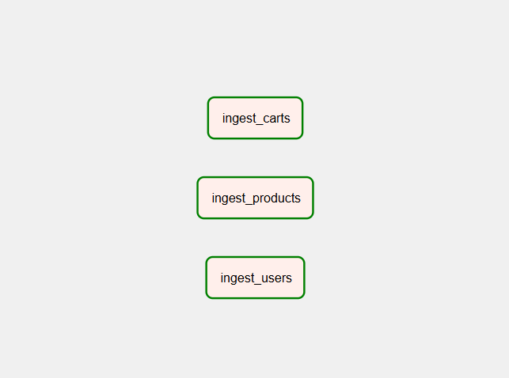
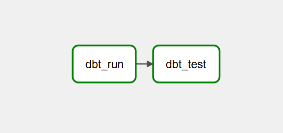
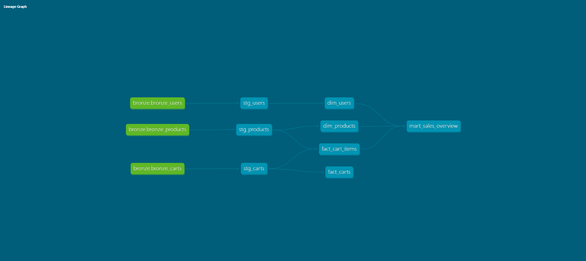

# 🛠️ End-to-End API ELT Pipeline with Docker, Airflow, PostgreSQL & dbt | Layered DWH Design
<small>
This project was designed and implemented as part of my learning path in data engineering and analytics engineering. It demonstrates my ability to design, build, and document a complete ELT pipeline using modern tools, frameworks, skills and best practices.
</small>

---

---

## Business Case & Problem Statement
Modern companies rely on external APIs and third-party systems (e.g., **e-commerce platforms, payment providers, or CRM tools**) to support analytics and decision-making. However, data from these APIs often comes in **raw JSON form**, which is:  

- **Messy and unstructured** → not directly usable for business reporting  
- **Manual and inconsistent** → requires repeated pulls without automation  
- **Lacking traceability** → difficult to track errors or confirm when data was last updated  
- **Not analytics-ready** → business teams cannot immediately use it for dashboards or KPIs  

This project simulates a **retail company scenario** where operations depend on the **Fakestore API** for information about products, users, and orders. Currently, data extraction is manual, which slows down decision-making and risks data inconsistencies.  

To solve this, the project introduces an automated **ELT pipeline** that:  
- Extracts and stores **raw API data** into a PostgreSQL database, applying a **layered architecture (Landing → Staging → Core → Marts)**  
- Uses **Apache Airflow** to orchestrate ingestion and transformations in dbt, manage schedules, and logging for debugging 
- Applies **dbt transformations** to clean Landing data into structured Staging tables, model Core business entities, and aggregate data in Marts  
- Lays the foundation for **dashboards and business reporting** (e.g., sales trends, product performance, customer activity)

---

## Project Goals
- Develop an **incremental ELT pipeline** to automate and optimize API data ingestion  
- Apply a **layered DWH architecture** for clean separation of raw, cleaned, and business-ready layers  
- Implement **logging, lineage, and error handling** to ensure data reliability and governance  
- Deliver **analytics-ready datasets** that directly answer business questions (e.g., product trends, customer behavior, revenue tracking)  
- Provide a **scalable foundation** for dashboards and stakeholder reporting  

---

## Architecture

### High-Level Pipeline Overview

  

The pipeline follows a straightforward flow: **API → Airflow → PostgreSQL (4 Layers) → BI Dashboards**

### Detailed Technical Architecture

  

- **Landing**: raw JSON payloads with metadata  
- **Staging** *(dbt)*: cleaned, structured tables  
- **Core** *(dbt)*: standardized business entities  
- **Marts** *(dbt)*: aggregated, business-facing datasets  

---

## Architecture Layers Explained

This project implements a **medallion-inspired layered architecture** to ensure data quality, traceability, and analytics readiness:

###  Landing Layer (Bronze)
**Purpose**: Store raw, unprocessed data exactly as received from the API  
**Implementation**: 
- PostgreSQL tables: `bronze.bronze_users`, `bronze.bronze_products`, `bronze.bronze_carts`
- Raw JSON payloads with metadata (extraction timestamp, source, record counts)
- Preserves data lineage and enables reprocessing if needed

**Key Point**: In dbt models, this layer is referenced as `bronze` (e.g., `{{ source('bronze', 'bronze_users') }}`), but conceptually it's the **Landing** layer in the warehouse design.

###  Staging Layer (Silver)
**Purpose**: Clean and normalize raw data into structured, analytics-friendly tables  
**Implementation**: 
- dbt models: `stg_users`, `stg_products`, `stg_carts`
- JSON parsing, data type casting, null handling, and basic transformations
- One-to-one relationship with Landing tables (every Landing table has a corresponding Staging table)

**Transformations**: 
- Extract nested JSON fields into columns
- Standardize data types and formats
- Apply basic business rules (e.g., filtering invalid records)

###  Core Layer (Gold - Star Schema)
**Purpose**: Model business entities using dimensional modeling principles  
**Implementation**: 
- **Dimension tables**: `dim_users`, `dim_products` (slowly changing dimensions with business keys)
- **Fact tables**: `fact_carts`, `fact_cart_items` (transactional data with foreign keys to dimensions)
- Star schema design optimized for analytical queries

**Design Philosophy**: This layer represents the "single source of truth" for business entities, enabling consistent reporting across the organization.

###  Marts Layer (Business-Facing)
**Purpose**: Pre-aggregated, business-specific datasets for reporting and dashboards  
**Implementation**: 
- dbt models: `mart_sales_overview` (aggregated sales metrics)
- Designed to answer specific business questions directly
- Optimized for BI tool consumption

**Example Use Cases**: 
- Daily/weekly/monthly sales trends
- Product performance analysis
- Customer behavior insights

---

## Tech Stack
- **Python** (data ingestion, utilities, dag creation, testing, validation)  
- **Apache Airflow** (scheduling & orchestration)  
- **PostgreSQL** (DWH)  
- **dbt** (transformations — staging → core → marts)  
- **Docker & Docker Compose** (containerization & local environment setup)  
- *(Planned)* **Grafana + Prometheus** for monitoring  
- *(Planned)* **GitHub Actions** for CI/CD  

---

## Project Status & Progress

### ✅ Completed
- Docker Compose setup for Airflow + PostgreSQL 
- Bronze (Landing) schema with JSON payloads + metadata  
- Recursive validation utility for JSON schema checks  
- Ingestion DAG (Products, Users, Orders) with full lineage + logging  
- Staging models for carts, products, and users (via dbt)  
- Core schema design (star schema with fact + dimensions)  
- Sales reporting mart with dbt for aggregated business reporting
### 🔜 In Progress / Planned
- **Dashboards / BI**: sample charts (e.g., order volume, sales trends, product performance)  
- **Lineage & Documentation**: dbt Docs + screenshots of DAGs and dbt lineage graph  
- **CI/CD**: GitHub Actions for automated dbt tests, builds, and Airflow DAG validation  
- **Monitoring**: Prometheus + Grafana dashboards for DAG health, latency, failures  

---

## Next Steps Roadmap (Actionable To-Do)
- [ ] Create **sample BI dashboard** (Metabase, Superset, or Power BI) using marts tables  
- [ ] Capture **screenshots** of dbt lineage graph, Airflow DAG runs, and BI dashboards  
- [ ] Set up **CI/CD pipeline** (GitHub Actions for dbt + Airflow checks)  
- [ ] Implement **monitoring stack** (Prometheus, Grafana)  
- [ ] Finalize **documentation** with tutorials, screenshots, and example queries  

---

## Documentation & Visuals

### Airflow DAG Overview

  

 

  

 

### dbt Lineage Graph

  

The lineage graph shows the complete data transformation flow:
- **Green nodes** (`bronze.bronze_*`): Landing layer tables (raw JSON from API)
- **Light blue nodes** (`stg_*`): Staging models (cleaned, structured data)
- **Dark blue nodes** (`dim_*`, `fact_*`): Core layer (star schema dimensions and facts)
- **Teal nodes** (`mart_*`): Business-facing aggregated datasets

This visualization demonstrates how data flows from raw API responses through multiple transformation stages, ultimately producing analytics-ready tables that power business insights.

### Sample Queries & Business KPIs
- ✅ **Sample queries + screenshots** (business KPIs, trends)  

### BI Dashboard Snapshots
- 🔜 **BI dashboard snapshots** (charts, metrics from marts tables)  

---

## Production-Level / Cloud Awareness
This project is built to run locally, but its design already considers scalability and reliability.  
Here's how it could evolve into a **production or cloud environment**:

- **Orchestration & Workflow Management** →  
  Deploy Airflow on **Amazon MWAA** instead of Docker Compose, with support for **CeleryExecutor** (distributed workers) or **KubernetesExecutor** (auto-scaled pods per task). Alternative serverless orchestration with **AWS Step Functions** for lightweight pipelines.  

- **Data Ingestion & Transformation** →  
  Replace local Python ETL with **AWS Glue** (ETL + catalog) for serverless, scalable transformations. For real-time ingestion, integrate **Kinesis** or **MSK (Managed Kafka)**.  

- **Data Storage & Warehousing** →  
  Replace PostgreSQL with **Amazon Redshift** for analytical workloads. Use **Athena** for serverless SQL on S3 data that acts as the bronze layer (via the Glue Data Catalog). In this local project, I simulated this Bronze concept inside Postgres with raw JSON storage. Store raw/curated datasets in **S3** with partitioned **Parquet/ORC** formats.  

- **Data Quality & Governance** →  
  Integrate **AWS Glue Data Quality** or **Great Expectations** for schema validation. In file-based pipelines this is typically applied at the S3 landing zone before loading to Bronze. In this project's design (API → Bronze DB with JSON storage), schema validation runs **between extraction and loading**, ensuring malformed records are rejected before persistence. Metadata, lineage, and quality results are tracked inside Bronze.  

- **Monitoring & Observability** →  
  Operational monitoring is handled via **Airflow task logs** and retries. Data-centric monitoring is enforced through the **logging table** (row counts, rejected records, timestamps). In production, this could be extended with **Amazon CloudWatch** or **AWS X-Ray** for centralized observability.  

- **Security & Compliance** →  
  Encrypt data with **KMS** and manage permissions via **IAM policies**.  
  Control networking with **VPC, subnets,  and security groups**.  

- **Cost Optimization** →  
  Implement **S3 lifecycle policies** (transition to IA/Glacier for archival data).  
  Use **Redshift pause/resume** for non-production environments.  
  Leverage **Spot instances** for batch processing workloads.  

---
